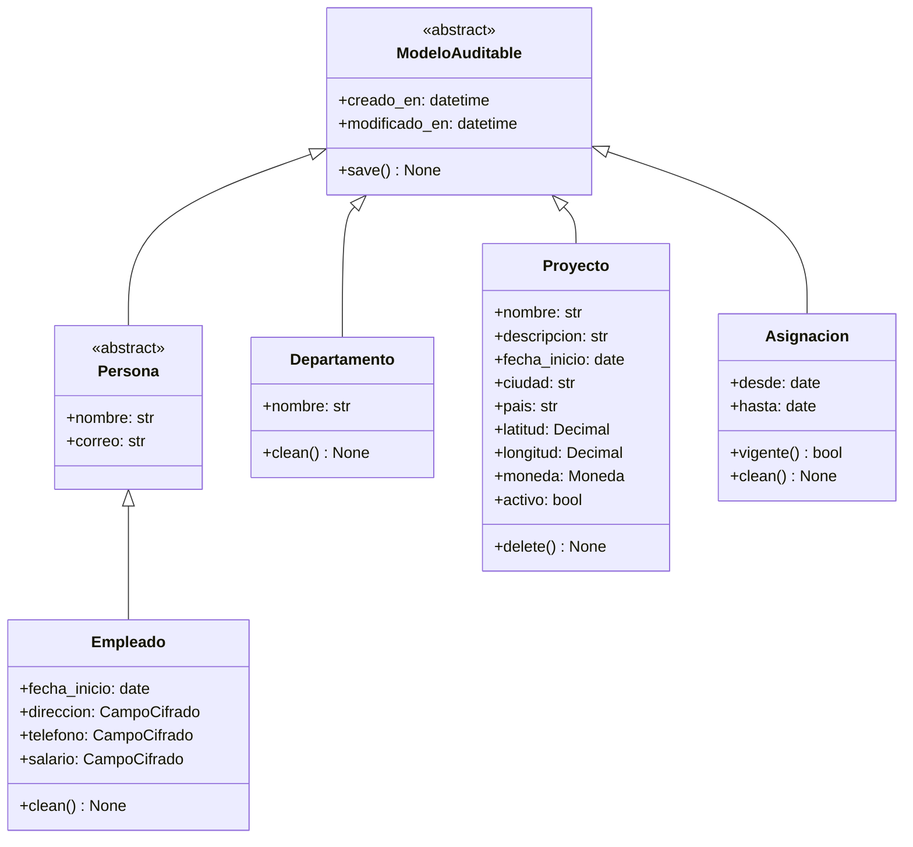
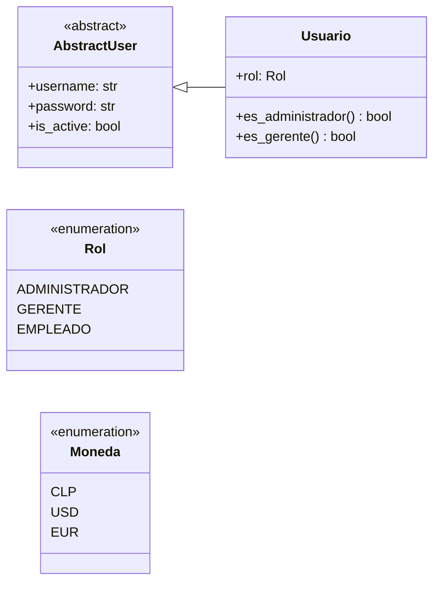
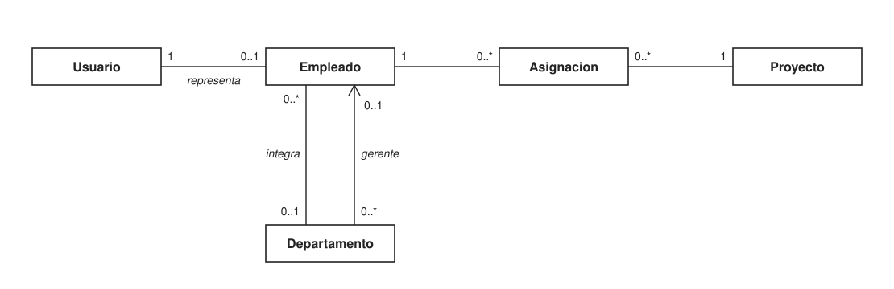
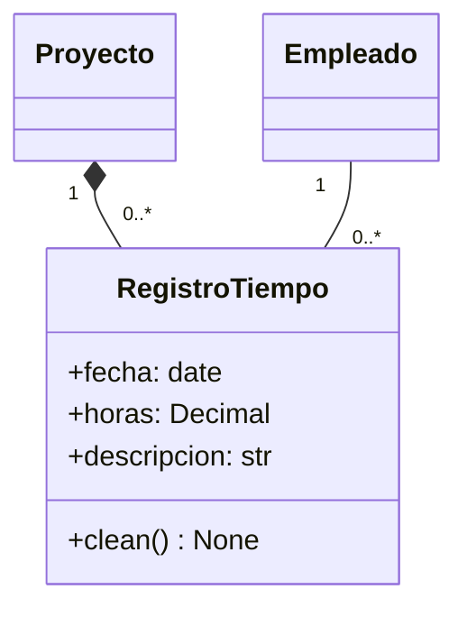
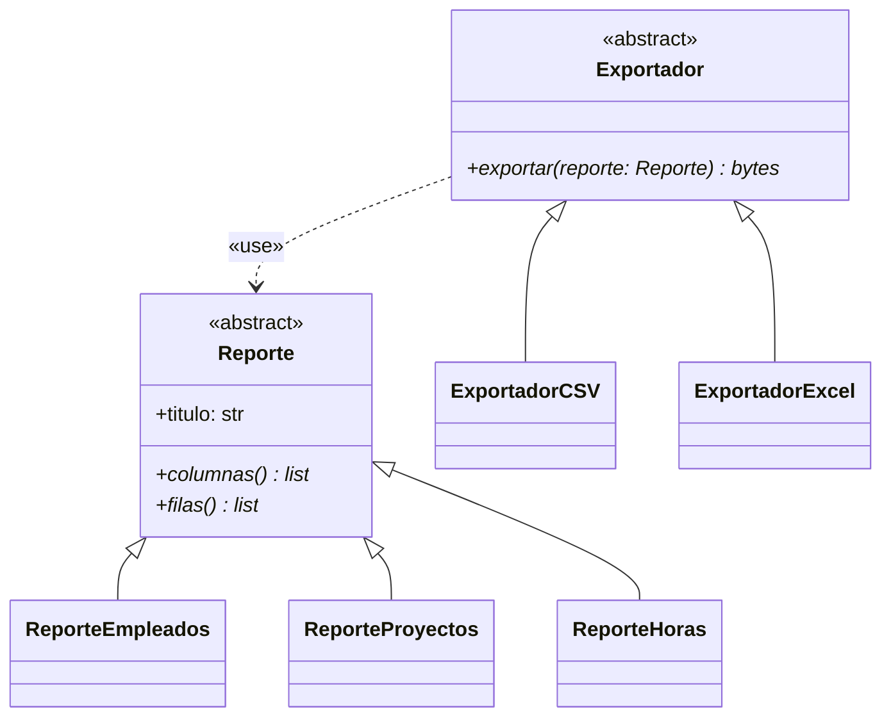
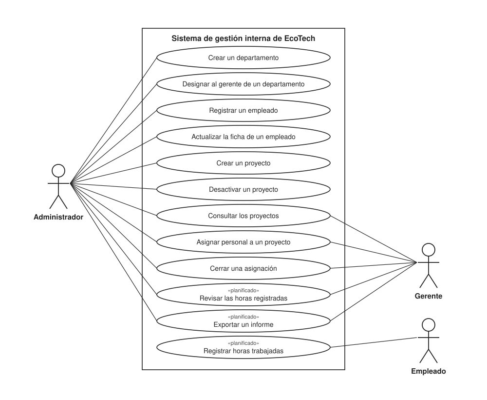
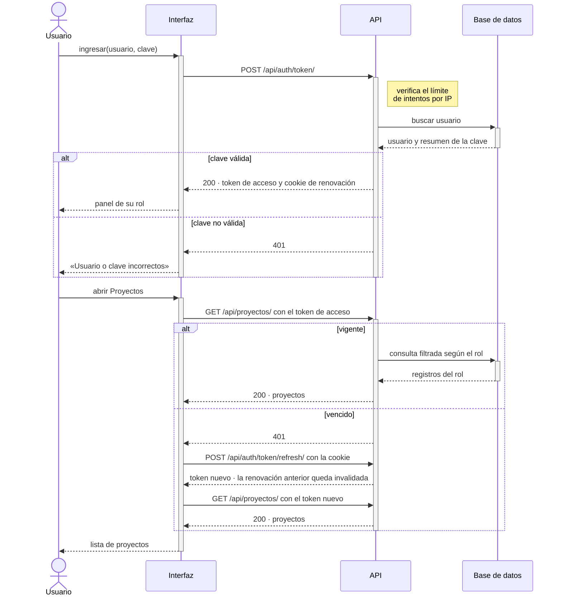

# EcoTech Solutions — Modelado UML

> Los diagramas de la **Unidad 1** de la asignatura, aplicados al sistema que está en este
> repositorio. No son un ejercicio aparte: cada clase existe en el código y cada relación tiene su
> implementación, indicada al lado.
>
> **Estos diagramas son un ejemplo para estudiantes**, y por eso se construyeron con la misma vara
> con que se corrigen: notación UML 2.5.1 en cada elemento, ninguna línea sobre un texto ni cruzando
> un elemento que no conecta, una sola convención de nombres y pie de figura en todas. La sección 5
> los revisa uno por uno contra esa vara.
>
> La mayoría de los diagramas están escritos en **Mermaid**, que GitHub dibuja a partir del texto: si
> el modelo cambia, el diagrama cambia en el mismo commit. Dos se dibujaron aparte, en SVG, en
> [`diagramas/`](diagramas): el de **casos de uso**, porque Mermaid no tiene la notación de actores ni
> de elipses, y el de **asociaciones**, porque el trazado automático encimaba las multiplicidades de
> dos asociaciones paralelas. Una herramienta que dibuja sola no exime de revisar lo que dibujó.

---

## 1. Diagrama de clases del dominio

Las clases de los hitos 1 a 4, que ya existen en `backend/apps/`. El modelo se presenta en **dos
diagramas**, uno para la jerarquía y otro para las asociaciones: UML permite mostrar un mismo modelo
en varios diagramas, y separarlos evita que las líneas de herencia se crucen con las de asociación.

### 1.1 Jerarquía: qué hereda de qué

*Figura 1 · Jerarquía de las clases del dominio. `ModeloAuditable` y `Persona` son abstractas.*

*Figura 2 · La cuenta de acceso y las dos enumeraciones. `AbstractUser` la aporta Django; `Rol` es
el tipo del atributo `Usuario.rol` y `Moneda`, el de `Proyecto.moneda`.*

### 1.2 Asociaciones: cómo se relacionan

*Figura 3 · Asociaciones del dominio, con su multiplicidad en ambos extremos. Entre Departamento y Empleado hay dos asociaciones distintas: la de integrar y la de dirigir, navegable desde el departamento.*

| En el diagrama | Relación UML | En el código |
|----------------|--------------|--------------|
| `ModeloAuditable <\|-- Persona` | **Generalización** desde una clase abstracta | `class Persona(ModeloAuditable)` con `abstract = True` en `Meta`: no genera tabla |
| `Persona <\|-- Empleado` | **Generalización** | `class Empleado(Persona)`: hereda nombre, correo y las fechas de auditoría |
| `Usuario "1" -- "0..1" Empleado` | **Asociación** uno a uno, opcional en un extremo | `OneToOneField(Usuario, null=True)`: no todo empleado tiene cuenta |
| `Departamento "0..1" -- "0..*" Empleado` | **Asociación** uno a muchos | `ForeignKey(Departamento, null=True, on_delete=SET_NULL)` |
| `Departamento --> Empleado : gerente` | **Asociación navegable** en un sentido | `ForeignKey("Empleado", null=True)`. La regla «el gerente pertenece al departamento» está en `clean()` |
| `Empleado — Asignacion — Proyecto` | **Asociación reificada**: la relación de muchos a muchos se modela como clase | `ManyToManyField(through="Asignacion")` |

### 1.3 Tres decisiones de modelado

**La asignación es una clase, no una línea.** Un empleado trabaja en varios proyectos y un proyecto
tiene varios empleados. Si la relación no tuviera datos propios, bastaría una línea `"0..*" -- "0..*"`
entre Empleado y Proyecto. Pero tiene **desde** y **hasta**. En UML eso se representa con una **clase
de asociación**, unida por una línea discontinua a la asociación; Mermaid no dibuja esa notación, de
modo que aquí se usa su equivalente: la **asociación reificada**, una clase intermedia con una
asociación hacia cada lado. Las multiplicidades lo delatan: un empleado tiene `0..*` asignaciones y
cada asignación es de exactamente `1` proyecto. En la base de datos, las dos formas son la misma
tercera tabla.

**Visibilidad en Python.** UML distingue `+` público y `-` privado. Python no impide el acceso a un
atributo: la privacidad es una convención (`_nombre`), y Django expone los campos del modelo como
atributos públicos. El diagrama usa `+` porque es lo que el código hace. El encapsulamiento se logra
por otra vía: **`CampoCifrado` oculta el cifrado** detrás de un atributo común, y las reglas de
negocio viven en `clean()`, que se ejecuta en cada guardado.

**Una sola convención de nombres, la de Python.** Clases en `UpperCamelCase` y atributos y métodos en
`snake_case`, como manda la guía de estilo de Python (PEP 8). Es un modelo de **implementación**: los
nombres coinciden letra por letra con el código. Lo que no se admite es mezclar convenciones en un
mismo diagrama. Si el diagrama fuera de análisis, independiente del lenguaje, usaría
`lowerCamelCase`, como los ejemplos de la asignatura.

---

## 2. El registro de horas y lo que viene: los informes

El registro de horas existe desde el hito 5, en `backend/apps/registros/`. Los informes están
planificados para el hito 6 y se dibujan aparte porque todavía no existen en el código.

*Figura 4 · El registro de horas. El rombo relleno indica composición: el registro no existe sin su
proyecto. Sus reglas —media hora, sin fechas futuras, dentro de una asignación vigente y hasta 12
horas diarias— están en `clean()`.*

*Figura 5 · Los informes y sus formatos de exportación, planificados para el hito 6. Las operaciones
marcadas con asterisco son abstractas: cada subclase las implementa.*

| Relación | Por qué |
|----------|---------|
| **Composición** Proyecto ◆— RegistroTiempo | Un registro de horas no existe sin su proyecto. En el código: `ForeignKey(Proyecto, on_delete=PROTECT)`, y un proyecto con horas no se elimina, se desactiva |
| **Polimorfismo** en `Reporte` y `Exportador` | La vista llama `exportador.exportar(reporte)` sin preguntar qué informe ni qué formato. Agregar PDF es una clase nueva, sin tocar las existentes |
| **Dependencia** `«use»` | El exportador recibe un reporte como parámetro, pero no lo guarda como atributo: no es una asociación |

---

## 3. Diagrama de casos de uso

*Figura 6 · Casos de uso del sistema. Los actores quedan fuera de la frontera; los casos con el
estereotipo «planificado» corresponden a hitos que aún no se construyen.*

**Cada caso de uso es un objetivo completo del actor**, nombrado con un verbo y su objeto. Por eso
no aparecen «Gestionar empleados» ni «Gestión de proyectos»: eso es un módulo que agrupa varios
objetivos distintos —registrar, actualizar, desactivar—, y cada uno se dibuja por separado.

**Iniciar sesión no aparece en el diagrama**, aunque existe: es una **precondición** de todos los
casos, no un objetivo del usuario. Nadie entra al sistema para iniciar sesión, sino para registrar un
empleado o sus horas.

**El estereotipo `«planificado»`** es propio de este proyecto. UML permite definir estereotipos para
marcar una variante de un elemento sin inventar una figura nueva: la elipse sigue siendo la de un caso
de uso.

| Caso de uso | Actores | Estado |
|-------------|---------|--------|
| Crear un departamento · Designar al gerente de un departamento | Administrador | ✅ Hito 3 |
| Registrar un empleado · Actualizar la ficha de un empleado | Administrador | ✅ Hito 3 |
| Crear un proyecto · Desactivar un proyecto | Administrador | ✅ Hito 4 |
| Consultar los proyectos · Asignar personal · Cerrar una asignación | Administrador y gerente; el gerente, solo con su gente | ✅ Hito 4 |
| Revisar las horas registradas | Administrador y gerente; el gerente, solo las de su gente | ✅ Hito 5 |
| Registrar horas trabajadas | Empleado, solo las suyas y de los últimos 7 días | ✅ Hito 5 |
| Exportar un informe | Administrador y gerente | ⏳ Hito 6 |

---

## 4. Diagrama de secuencia: el inicio de sesión y la renovación

Muestra **en qué orden** ocurre algo y **quién** le habla a quién. Las flechas llenas son mensajes
síncronos; las discontinuas, respuestas. Las barras verticales indican cuándo cada participante está
activo, y los fragmentos `alt` muestran las decisiones. Es el flujo que protege la sesión, descrito en
[`seguridad.md`](seguridad.md) §4.

*Figura 7 · Inicio de sesión y renovación automática del token de acceso.*

---

## 5. Revisión contra la vara de corrección

| Diagrama | Qué se verificó |
|----------|-----------------|
| Clases · Figuras 1 a 5 | Ninguna multiplicidad encimada ni cortada; clases abstractas marcadas; atributos **tipados**; operaciones con tipo de retorno; **generalización** presente; multiplicidad en **ambos extremos** de cada asociación; una sola convención de nombres |
| Casos de uso · Figura 6 | Actores con su notación y **fuera** de la frontera; casos como **elipses**, nombrados con verbo y objeto; ningún «Gestionar …»; ninguna línea sobre un texto ni cruzando una elipse que no conecta |
| Secuencia · Figura 7 | Líneas de vida con **activación**; mensajes síncronos y respuestas distinguidos; **fragmentos `alt`** donde hay una decisión, con guardas que ninguna línea de vida atraviesa |
| Todas | Pie de figura numerado; cada diagrama coincide con el código o está marcado como planificado |

---

## 6. Correspondencia entre UML y el código

| Concepto de la Unidad 1 | Notación UML | En Python y Django |
|-------------------------|--------------|--------------------|
| Clase | Rectángulo con nombre, atributos y operaciones | `class Proyecto(models.Model)` |
| Atributo | `+nombre: str` | `nombre = models.CharField(...)` |
| Operación | `+vigente() bool` | `def vigente(self) -> bool` o `@property` |
| Clase abstracta | `<<abstract>>` | `class Meta: abstract = True` |
| Operación abstracta | `columnas()*` | `@abstractmethod` |
| Enumeración | `<<enumeration>>` | `class Rol(models.TextChoices)` |
| Generalización | Línea con triángulo vacío | `class Empleado(Persona)` |
| Asociación | Línea con multiplicidad | `ForeignKey`, `OneToOneField` |
| Muchos a muchos con atributos | Clase de asociación, o asociación reificada | `ManyToManyField(through=...)` |
| Composición | Rombo relleno en el extremo del todo | `ForeignKey(on_delete=PROTECT)` y la regla de no eliminar |
| Dependencia | Flecha discontinua, `«use»` | Una clase que usa otra sin guardarla como atributo |

La explicación de dónde vive cada concepto de programación orientada a objetos —herencia,
encapsulamiento, polimorfismo— está en [`architecture.md`](architecture.md) §3.

---

*Última actualización: 2026-09-30*
