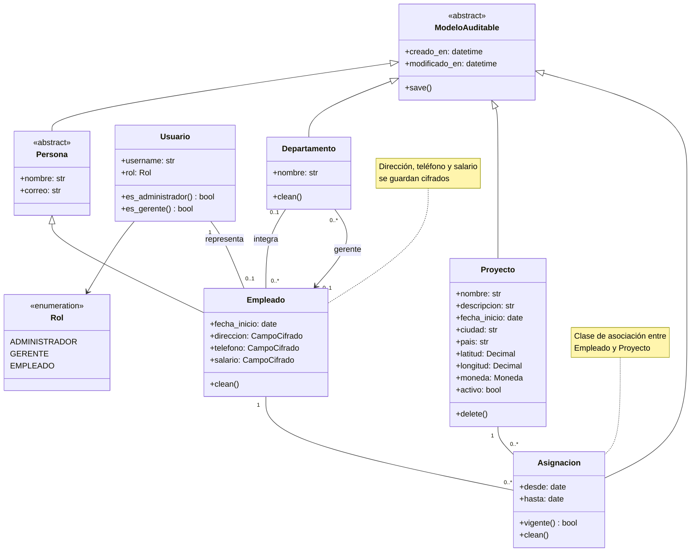
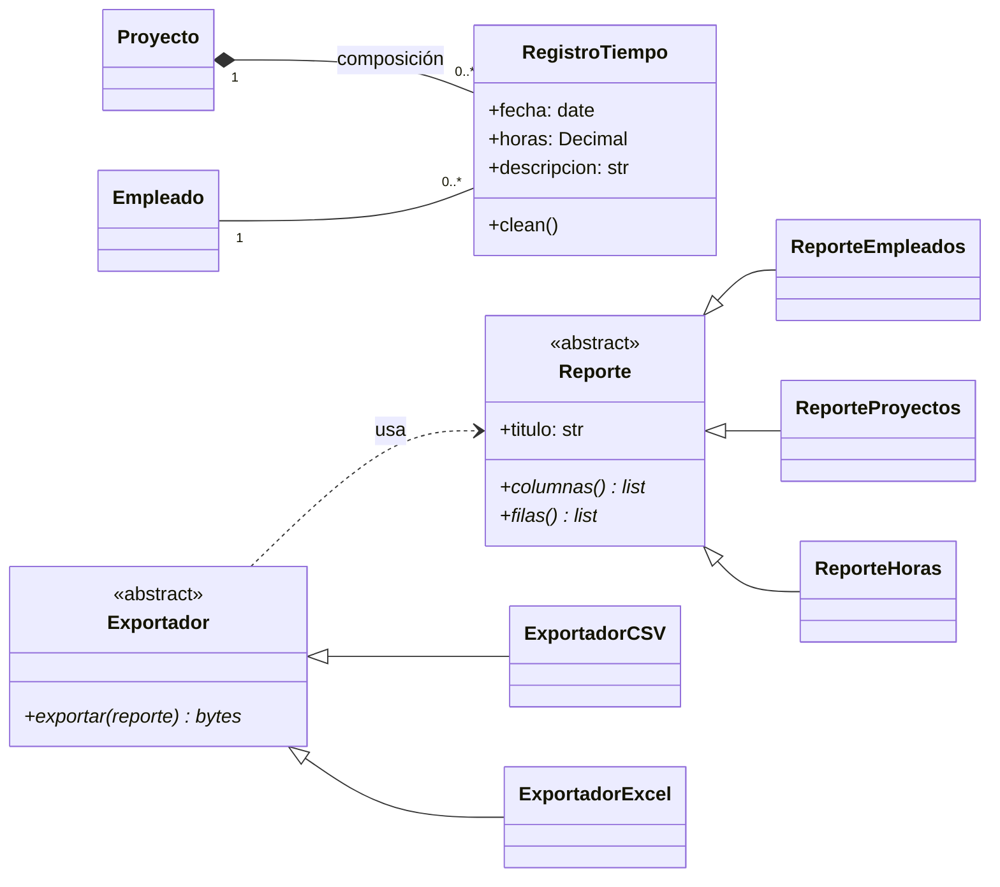
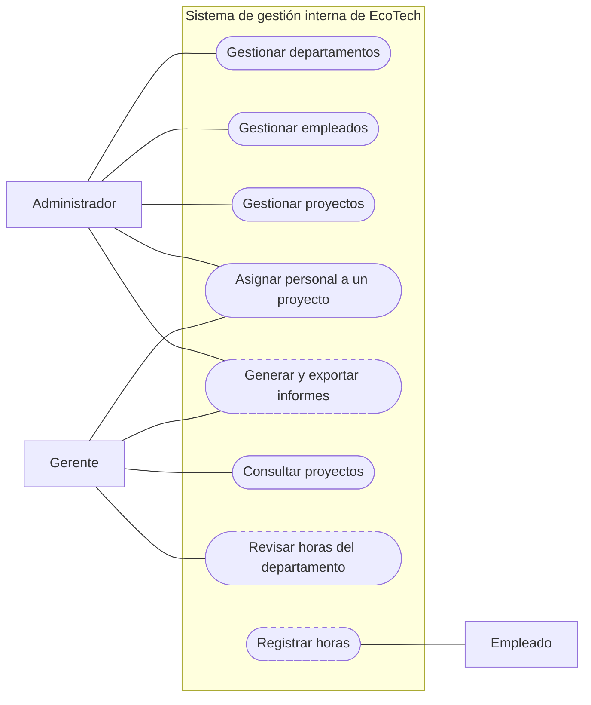
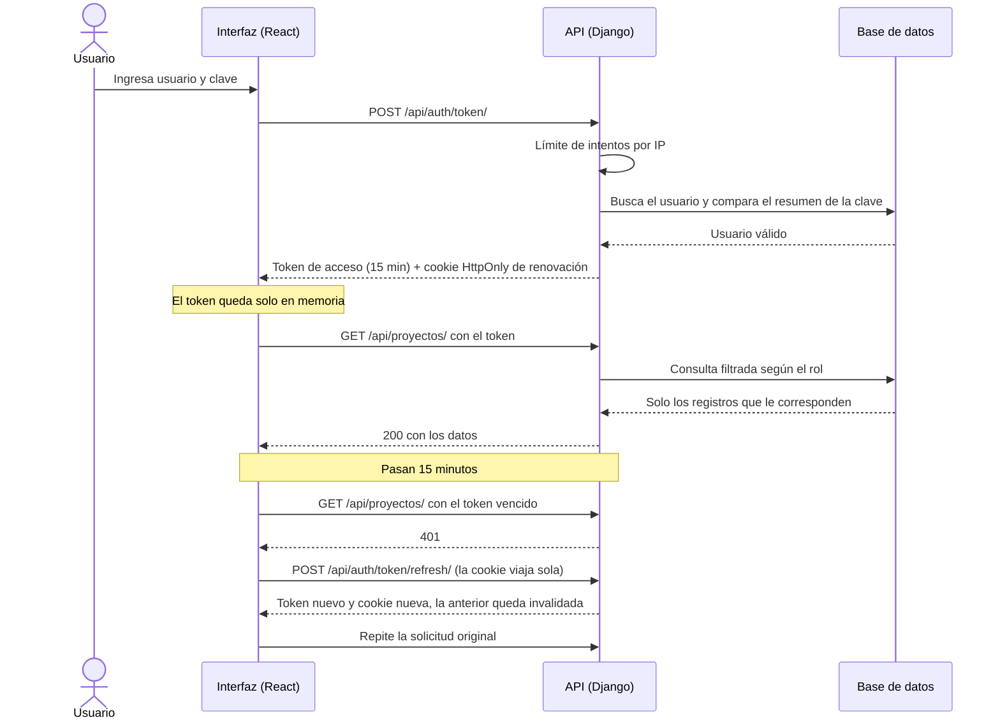

# EcoTech Solutions — Modelado UML

> Los diagramas de la **Unidad 1** de la asignatura, aplicados al sistema que está en este
> repositorio. No son un ejercicio aparte: cada clase existe en el código y cada relación tiene su
> implementación, indicada al lado.
>
> Los diagramas están escritos en **Mermaid**, un lenguaje de texto que GitHub dibuja directamente.
> Al estar escritos como texto, se versionan junto al código: si el modelo cambia, el diagrama
> cambia en el mismo commit.

---

## 1. Diagrama de clases del dominio

Las clases de los hitos 1 a 4, que ya existen en `backend/apps/`.

### 1.1 Cómo se lee cada relación

| En el diagrama | Relación UML | En el código |
|----------------|--------------|--------------|
| `ModeloAuditable <\|-- Persona` | **Herencia** de una clase abstracta | `class Persona(ModeloAuditable)` con `abstract = True` en `Meta`: no genera tabla |
| `Persona <\|-- Empleado` | **Herencia** | `class Empleado(Persona)`: hereda nombre, correo y las fechas de auditoría |
| `Usuario "1" -- "0..1" Empleado` | **Asociación** uno a uno, opcional | `OneToOneField(Usuario, null=True)`: no todo empleado tiene cuenta |
| `Departamento "0..1" -- "0..*" Empleado` | **Asociación** uno a muchos | `ForeignKey(Departamento, null=True, on_delete=SET_NULL)` |
| `Departamento --> Empleado : gerente` | **Asociación** dirigida | `ForeignKey("Empleado", null=True)`; la regla «el gerente pertenece al departamento» está en `clean()` |
| `Empleado — Asignacion — Proyecto` | **Clase de asociación** de muchos a muchos | `ManyToManyField(through="Asignacion")`: la relación tiene sus propios atributos, `desde` y `hasta` |

### 1.2 Tres decisiones de modelado

**La asignación es una clase, no una línea.** Un empleado trabaja en varios proyectos y un proyecto
tiene varios empleados: es una relación de muchos a muchos. Si fuera solo eso, bastaría una línea
entre las dos clases. Pero la relación **tiene datos propios** —desde cuándo y hasta cuándo—, y por
eso se modela como clase de asociación. En la base es una tercera tabla.

**Visibilidad en Python.** UML distingue `+` público y `-` privado. Python no impide el acceso a un
atributo: la privacidad es una convención (`_nombre`). Django, además, expone los campos del modelo
como atributos públicos. El diagrama usa `+` porque es lo que el código hace, y el encapsulamiento se
logra por otra vía: **`CampoCifrado` oculta el cifrado** detrás de un atributo común, y las reglas de
negocio viven en `clean()`, que se ejecuta en cada guardado.

**Las multiplicidades son reglas de negocio.** `0..1` entre Empleado y Departamento dice que un
empleado puede no tener departamento; en el código es `null=True`. Si fuera `1`, sería
`null=False`. Leer la multiplicidad del diagrama es leer una regla del caso.

---

## 2. Lo que viene: el registro de horas y los informes

Planificado para los hitos 5 y 6. Se dibuja aparte porque todavía no existe en el código.

| Relación | Por qué |
|----------|---------|
| **Composición** Proyecto ◆— RegistroTiempo | Un registro de horas no existe sin su proyecto. En el código: `ForeignKey(Proyecto, on_delete=PROTECT)`, y un proyecto con horas no se elimina, se desactiva |
| **Polimorfismo** en `Reporte` y `Exportador` | La vista llama `exportador.exportar(reporte)` sin preguntar qué informe ni qué formato. Agregar PDF es una clase nueva, sin tocar las existentes |

---

## 3. Diagrama de casos de uso

Mermaid no tiene una notación propia de casos de uso. Se aproxima con un diagrama de flujo: los
actores quedan fuera del recuadro, que es el límite del sistema, y los casos de uso, dentro, en
forma de óvalo. Los marcados con línea discontinua están planificados.

**Iniciar sesión no aparece en el diagrama**, aunque existe: es una **precondición** de todos los
casos, no un objetivo del usuario. Nadie entra al sistema para iniciar sesión, sino para gestionar un
proyecto o registrar sus horas. Dibujarlo unido a los tres actores solo agrega líneas cruzadas.

| Caso de uso | Actores | Estado |
|-------------|---------|--------|
| Iniciar sesión | Los tres | ✅ Hito 2 |
| Gestionar departamentos y empleados | Administrador | ✅ Hito 3 |
| Gestionar proyectos | Administrador | ✅ Hito 4 |
| Asignar personal a un proyecto | Administrador; gerente, solo a su gente | ✅ Hito 4 |
| Consultar proyectos | Gerente | ✅ Hito 4 |
| Registrar horas · Revisar horas | Empleado · Gerente | ⏳ Hito 5 |
| Generar y exportar informes | Administrador y gerente | ⏳ Hito 6 |

---

## 4. Diagrama de secuencia: el inicio de sesión

Muestra **en qué orden** ocurre algo y **quién** le habla a quién. Este es el flujo que protege la
sesión, descrito en [`seguridad.md`](seguridad.md) §4.

---

## 5. Correspondencia entre UML y el código

| Concepto de la Unidad 1 | Notación UML | En Python y Django |
|-------------------------|--------------|--------------------|
| Clase | Rectángulo con nombre, atributos y métodos | `class Proyecto(models.Model)` |
| Atributo | `+nombre: str` | `nombre = models.CharField(...)` |
| Método | `+vigente() bool` | `def vigente(self) -> bool` o `@property` |
| Clase abstracta | `<<abstract>>` | `class Meta: abstract = True` |
| Enumeración | `<<enumeration>>` | `class Rol(models.TextChoices)` |
| Herencia | Flecha con triángulo vacío | `class Empleado(Persona)` |
| Asociación | Línea con multiplicidad | `ForeignKey`, `OneToOneField` |
| Muchos a muchos con atributos | Clase de asociación | `ManyToManyField(through=...)` |
| Composición | Rombo relleno | `ForeignKey(on_delete=PROTECT)` y la regla de no eliminar |
| Dependencia | Flecha discontinua | Una clase que usa otra sin guardarla como atributo |

La explicación de dónde vive cada concepto de programación orientada a objetos —herencia,
encapsulamiento, polimorfismo— está en [`architecture.md`](architecture.md) §3.

---

*Última actualización: 2026-09-30*
